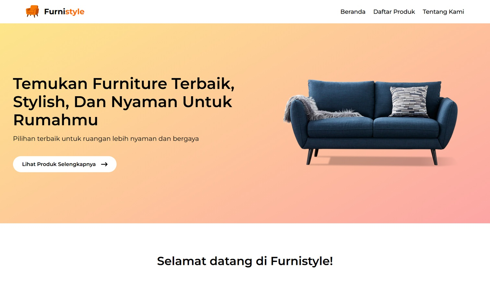

<!-- PROJECT LOGO -->
<div align="center">
  

  <h3 align="center">Furnistyle</h3>

  <p align="center">
    A modern furniture catalog web app made with React and Tailwind — with clean UI and dynamic data integration.
    <br />
    <a href="https://furnistyle-bice.vercel.app">View Demo</a>
    ·
    <a href="https://github.com/naufalf25/furnistyle/issues/new">Report Bug</a>
  </p>
</div>

<!-- TABLE OF CONTENTS -->
<details>
  <summary>Table of Contents</summary>
  <ol>
    <li>
      <a href="#about-the-project">About The Project</a>
      <ul>
        <li><a href="#built-with">Built With</a></li>
      </ul>
    </li>
    <li>
      <a href="#getting-started">Getting Started</a>
      <ul>
        <li><a href="#installation">Installation</a></li>
      </ul>
    </li>
    <li><a href="#contact-me">Contact Me</a></li>
    <li><a href="#acknowledgments">Acknowledgments</a></li>
  </ol>
</details>

<!-- ABOUT THE PROJECT -->

## About The Project

Furnistyle is a responsive front-end web application that showcases a dynamic catalog of furniture products. Built with React and Tailwind CSS, it focuses on delivering a clean UI and smooth user experience for exploring furniture collections.

This project uses product data from the [DummyJSON API](https://dummyjson.com) to display a dynamic list of furniture items.

### Built With


<!-- GETTING STARTED -->

## Getting Started

### Installation

1. Clone the repo
   ```sh
   git clone https://github.com/naufalf25/furnistyle.git
   ```
2. Install NPM packages
   ```sh
   cd furnistyle
   npm install
   ```
3. Start the development
   ```sh
   npm run dev
   ```

<!-- CONTACT -->

## Contact Me

[![Linkedin][linkedin-shield]][linkedin-url]
[![Gmail][gmail-shield]][gmail-url]

<!-- ACKNOWLEDGMENTS -->

## Acknowledgments

- [React Icons](https://react-icons.github.io/react-icons/search)
- [Axios](https://axios-http.com)

<!-- MARKDOWN LINKS & IMAGES -->
<!-- https://www.markdownguide.org/basic-syntax/#reference-style-links -->

[linkedin-shield]: https://img.shields.io/badge/-LinkedIn-black.svg?style=for-the-badge&logo=linkedin&colorB=555
[linkedin-url]: https://www.linkedin.com/in/muhnaufalfarras
[gmail-shield]: https://img.shields.io/badge/Gmail-D14836?style=for-the-badge&logo=gmail&logoColor=white
[gmail-url]: https://mail.google.com/mail/u/0/?tf=cm&fs=1&to=opal.farras@gmail.com
